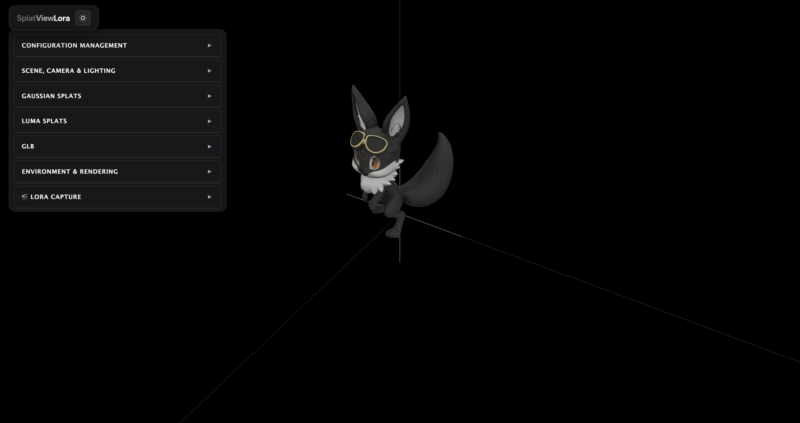

# SplatViewLora



A WebGL application for viewing Gaussian Splats and generating LoRA training datasets using [Three.js](https://threejs.org/).

## Supported Formats

- **PLY** (`.ply`) - Standard Gaussian Splat format
- **SPLAT** (`.splat`) - Antimatter15 splat format  
- **KSPLAT** (`.ksplat`) - Optimized format with faster loading times
- **Luma AI captures** - Direct support for lumalabs.ai captures
- **GLB/GLTF** - 3D models

## Key Features

### 🎬 LoRA Dataset Capture

Automatically generate training datasets for LoRA fine-tuning directly from your 3D captures:

- **32 to 96 poses** captured automatically
- **3 distance variations**: Close-up, Normal, Wide shot
- **8 azimuth angles** × **4 elevation levels** = Complete coverage
- **Elevation angles**: -30° (low-angle), 0° (eye-level), 30° (elevated), 60° (high-angle)
- **Optional .txt captions** for each image
- **One-click download** as a ready-to-use dataset (ZIP)
- Perfect for training LoRA models on your own 3D subjects

### 🌐 Viewing & Editing

- **OrbitControls**: Camera controllable with mouse (rotation, zoom, pan)
- **Circular 360 Mode**: Camera automatically rotates around the origin
- **Multi-format support**: Load `.ply`, `.splat`, or `.ksplat` Gaussian Splat files
- **Luma Splats**: Load captures from lumalabs.ai with semantic masking
- **GLB models**: Import and manipulate 3D models
- **Gizmo controls**: Transform objects with translate/rotate/scale tools

### 🎨 Rendering

- **Lighting system**: Ambient + 3-point directional lighting (Key, Fill, Back)
- **Environment maps**: HDR equirectangular environment support
- **ToneMapping**: None / ACESFilmic / Reinhard with adjustable exposure
- **Bloom effect**: Post-processing with configurable threshold, strength, radius

### 💾 Scene Configuration

- Save complete scene setups
- Load and restore configurations
- Share your setups with others

All settings are controllable via a modern dark/light UI panel for real-time configuration.

## Installation

```bash
npm install
npm run dev
```

Open http://localhost:3000 in your browser.

## Usage

### Basic Viewing
1. Load a file via URL or select a local `.ply`, `.splat`, or `.ksplat` file
2. Adjust transforms (position, rotation, scale) using the gizmo controls
3. Configure lighting, environment, and post-processing effects

### LoRA Dataset Capture
1. Load your Gaussian Splat scene
2. Open the **🎬 LoRA Capture** panel (at the bottom)
3. Configure camera radius and distance variations
4. Enable/disable `.txt` caption export as needed
5. Click **📸 Start Capture** to begin automatic capture
6. Click **💾 Download Dataset** to get your training images

## Technical Notes

- The viewer is recreated each time a new splat file is loaded
- Camera defaults to OrbitControls, with optional circular360 mode for automated rotation
- Uses ES Modules with Vite as dev server
- KSPLAT format provides the fastest loading times

## License

This project is free to use, fork, and extend.
